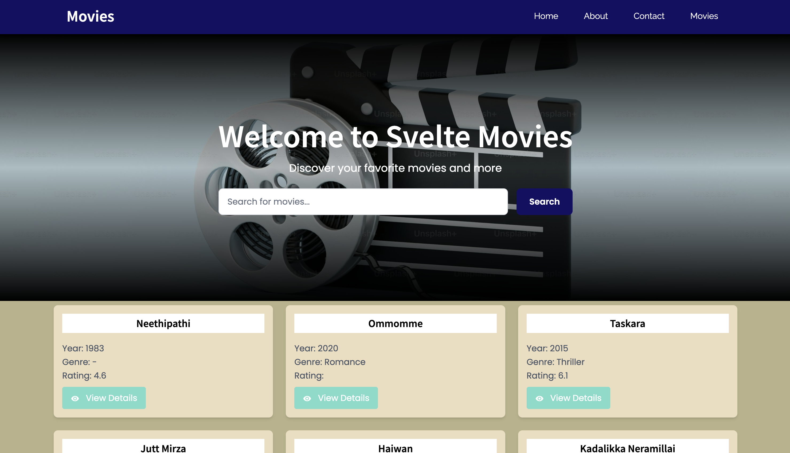

# Svelte Kit Games




## About the Project

Svelte Kit Games is a web application built with SvelteKit, TailwindCSS, and TypeScript. It allows users to browse and play various games. The project leverages modern web technologies to provide a fast, responsive, and engaging user experience.

For game data and APIs, it uses the following endpoint which is also created by me: https://softgenie.org/api/games

## Screenshots

Would be added later as there are plans to change the UI.

## SSR - When to render on client and when on server?

Server-side rendering (SSR) is used strategically in this project:

- **Render on the server** when the data is dynamic, sensitive, or needs to be indexed by search engines. For example, fetching game details from an API or ensuring SEO for game pages.
- **Render on the client** when the data is user-specific, frequently updated, or doesn't need to be indexed. For example, displaying a user's game progress or handling client-side interactions like filtering and sorting games.

Here, on the game details page, the whole content is being loaded on the server, and meta tags are being populated through the dynamic data.

By balancing SSR and client-side rendering, you can optimize performance and user experience.

### Features

- Browse a collection of games.
- Play games directly in the browser.
- View detailed information about games, including genre, rating, and description.
- Responsive design for seamless use on desktop and mobile devices.

### Technologies Used

- **SvelteKit**: A modern framework for building fast and scalable web applications.
- **TailwindCSS**: A utility-first CSS framework for styling.
- **TypeScript**: A strongly typed programming language for better code quality and maintainability.

### State Management

Svelte's built-in stores are highly efficient for state management as they are lightweight and reactive by design. They eliminate the need for complex state management libraries by providing a simple and intuitive API. Stores in Svelte automatically update the UI whenever their values change, ensuring seamless reactivity with minimal boilerplate. Additionally, they are highly performant due to Svelte's compile-time optimizations, making them ideal for managing both local and global state in your application.

### Getting Started

To run the project locally, follow these steps:
1. Clone the repository:
    ```bash
    git clone https://github.com/apfirebolt/svelte-kit-games.git
    ```
2. Navigate to the project directory:
    ```bash
    cd svelte-kit-games
    ```
3. Install dependencies:
    ```bash
    npm install
    ```
4. Start the development server:
    ```bash
    npm run dev
    ```
5. Open your browser and navigate to `http://localhost:8080`.

### Contributing
Contributions are welcome! Feel free to open an issue or submit a pull request.

### License
This project is licensed under the MIT License. See the `LICENSE` file for details.